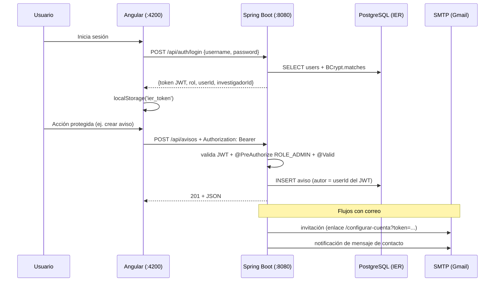
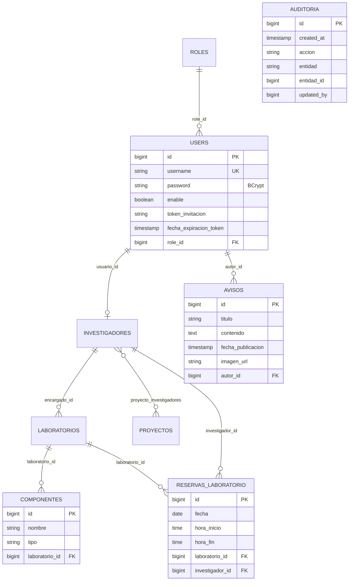

# PROJECT_CONTEXT.md — Instituto (IER)

Documentación técnica del proyecto. Actualizada el **2026-07-04** tras la implementación de seguridad (JWT/BCrypt), el flujo de invitación por correo, los módulos de reservas y avisos, y el frontend completo.

## Índice

1. [Historial de cambios](#1-historial-de-cambios)
2. [Arquitectura general](#2-arquitectura-general)
3. [Backend](#3-backend)
4. [Frontend](#4-frontend)
5. [Comunicación Frontend ↔ Backend](#5-comunicación-frontend--backend)
6. [Base de datos](#6-base-de-datos)
7. [Flujos del sistema](#7-flujos-del-sistema)
8. [Dependencias](#8-dependencias)
9. [Variables de entorno](#9-variables-de-entorno)
10. [Seguridad](#10-seguridad)
11. [Problemas conocidos / pendientes](#11-problemas-conocidos--pendientes)
12. [Guía para un nuevo desarrollador](#12-guía-para-un-nuevo-desarrollador)
13. [Mapa completo del proyecto](#13-mapa-completo-del-proyecto)

---

## 1. Historial de cambios

**2026-07-03 — Limpieza estructural:** `api/api` → `backend/`, `frontend-instituto` → `frontend/`; se eliminaron artefactos de build, `TestController` de diagnóstico y el `app.config.ts` duplicado; typos de `pom.xml` corregidos; repo git unificado en la raíz.

**2026-07-04 — Implementación de funcionalidades y seguridad (plan IER):**
- **Seguridad:** Spring Security + BCrypt + JWT (HS256 vía oauth2-resource-server). Migración automática de contraseñas en texto plano al arrancar. CORS por variable de entorno. Credenciales de BD extraídas a variables de entorno.
- **Flujo de invitación:** el admin registra nombre+correo → cuenta inactiva con `token_invitacion` (48h) → email con enlace → el investigador establece su contraseña en `/configurar-cuenta`.
- **Modelo de datos:** `Componente` ahora pertenece a un `Laboratorio` (ManyToOne); nuevas entidades `ReservaLaboratorio` (con validación anti-traslapes) y `Aviso` (con autor admin); `Auditoria` extendida con `accion`/`entidad`/`entidad_id`; validaciones JSR-380 en todas las entidades de entrada; `ddl-auto=update` para que Hibernate cree lo nuevo.
- **API:** endpoints nuevos (`/api/auth/*`, `/api/avisos`, `/api/reservas`, `/api/auditoria`, `/api/proyectos/destacados`, `/api/investigadores/mi-perfil`), `@PreAuthorize` por rol en todas las mutaciones, filtros (`?area=`, `?laboratorioId=`, `?investigadorId=`), contacto que notifica por SMTP, auditoría automática en mutaciones de proyectos/laboratorios/perfiles, manejador global de excepciones.
- **Frontend:** HttpClient + interceptor JWT + guards; páginas públicas (home con avisos y destacados, laboratorios con materiales, investigadores con filtro Agua/Energía, calendario mes/semana/día, contacto con validación Gmail); login; `/configurar-cuenta`; panel de investigador (perfil propio + reservas); panel de administrador (invitaciones, CRUDs completos, edición de perfiles, visor de auditoría).

**2026-07-04 — Limpieza, UI/UX y documentación:**
- **Layout:** footer siempre al fondo de la ventana (flexbox en `styles.css` sobre `app-root`/`main`); antes quedaba a media página con contenido corto.
- **Navbar responsive:** patrón collapse de Bootstrap con botón hamburguesa; se agregó `bootstrap.bundle.min.js` a `angular.json` (antes solo se cargaba el CSS, ningún componente interactivo de Bootstrap funcionaba).
- **UI:** contenido real en "Quiénes Somos" (era un placeholder), `index.html` con `lang="es"` y título correcto, botón de agendar con ícono.
- **Código:** URL del backend deduplicada en `core/api.constants.ts`; eliminados 5 CSS vacíos y sus `styleUrl`; corregido `app.spec.ts` roto; bug del calendario al construir semanas del mes; en backend se eliminó código muerto (`RolService`, `UsuarioService.guardar`, `ProyectoService.obtenerPorId`, métodos de repos sin uso) y los comentarios de parche heredados; borrado `HELP.md`.
- **Repo:** `.gitignore` único en la raíz (se eliminaron los de backend/frontend, redundantes), `README.md` en la raíz y README del frontend reescrito sin boilerplate; se ignora `.claude/settings.local.json`.
- **Entorno:** variables de BD renombradas a `IER_DB_*` y script `backend/run.sh` (las `SPRING_DATASOURCE_*` globales de otro proyecto de esta máquina tienen prioridad sobre `application.properties` y rompían el arranque). BD de desarrollo en Docker: contenedor `ier-postgres` con roles y usuario `admin`/`admin123` sembrados.

---

## 2. Arquitectura general

Monorepo con dos proyectos:

| | Backend | Frontend |
|---|---|---|
| Carpeta | `backend/` | `frontend/` |
| Stack | Java 17, Spring Boot 4.0.1, Maven | Angular 20.3 (standalone), TypeScript 5.9 |
| Seguridad | Spring Security 7, JWT HS256, BCrypt | Interceptor JWT, guards por rol |
| Datos | PostgreSQL (`IER`), Spring Data JPA/Hibernate | — |
| UI | — | Bootstrap 5.3 + bootstrap-icons |
| Arquitectura | Capas: Controller → Service → Repository → Entity | `core/` (servicios/guards) + `pages/` + `components/` |

Se ejecutan por separado: backend en `:8080`, frontend en `:4200` (CORS ya configurado).

---

## 3. Backend

### 3.1 Estructura

```
backend/src/main/java/com/instituto/api/
├── ApiApplication.java        # punto de entrada
├── controller/                # 10 controllers REST + GlobalExceptionHandler
├── dto/                       # records de auth: LoginRequest/Response, InvitacionRequest, ConfigurarCuentaRequest
├── entity/                    # 11 entidades JPA
├── repository/                # 11 interfaces Spring Data JPA
├── security/                  # SecurityConfig, JwtService, PasswordMigrationRunner
└── service/                   # 8 services
```

### 3.2 Entidades

| Entidad | Tabla | Relaciones | Notas |
|---|---|---|---|
| `Usuario` | `users` | `@ManyToOne` → `Rol` | password BCrypt (WRITE_ONLY en JSON), `enable`, `token_invitacion` + `fecha_expiracion_token` (nunca serializados) |
| `Rol` | `roles` | — | rol id 4 = INVESTIGADOR (convención existente) |
| `Investigador` | `investigadores` | `@OneToOne` → `Usuario` | perfil creado automáticamente al invitar/registrar rol 4 |
| `Laboratorio` | `laboratorios` | `@ManyToOne` → `Investigador` (encargado) | |
| `Componente` | `componentes` | `@ManyToOne` → `Laboratorio` (**obligatorio** vía `@NotNull`) | materiales de cada laboratorio |
| `Proyecto` | `proyectos` | `@ManyToMany` → `Investigador` | `esDestacado` para el home |
| `ReservaLaboratorio` | `reservas_laboratorio` | `@ManyToOne` → `Laboratorio`, `Investigador` | fecha + hora_inicio/hora_fin; sin traslapes por laboratorio/día |
| `Aviso` | `avisos` | `@ManyToOne` → `Usuario` (autor) | autor = admin autenticado, asignado por el servidor |
| `Actividad` | `actividades` | — | |
| `Contacto` | `contacto` | — | dispara notificación SMTP al guardarse |
| `Auditoria` | `auditoria` | — | `accion`, `entidad`, `entidad_id`, `updated_by` (usuario del JWT), `created_at` |

### 3.3 Endpoints y matriz de roles

| Ruta | GET | POST | PUT | DELETE |
|---|---|---|---|---|
| `/api/auth/login` | — | público | — | — |
| `/api/auth/invitaciones` | — | **Admin** | — | — |
| `/api/auth/invitaciones/{token}` | público (validar) | — | — | — |
| `/api/auth/configurar-cuenta` | — | público (con token) | — | — |
| `/api/avisos` | público | Admin | Admin | Admin |
| `/api/proyectos` (+`/destacados`) | público | Admin | Admin | Admin |
| `/api/laboratorios` | público | Admin | Admin | Admin |
| `/api/investigadores` (`?area=`) | público | Admin | Admin **o el propio investigador** | Admin |
| `/api/investigadores/mi-perfil` | Investigador | — | — | — |
| `/api/componentes` (`?laboratorioId=`) | público | Admin | Admin | Admin |
| `/api/reservas` (`?investigadorId=`) | público | Admin + Investigador | — | Admin + Investigador (solo las propias) |
| `/api/actividades` | público | Admin | Admin | Admin |
| `/api/contacto` | — | público (guarda + email) | — | — |
| `/api/usuarios` | Admin | Admin | — | Admin |
| `/api/auditoria` | Admin | — | — | — |

"Admin" acepta roles llamados `ADMIN` o `ADMINISTRADOR` (el nombre del rol en BD se convierte a autoridad `ROLE_<NOMBRE>` en mayúsculas).

### 3.4 Flujo de una petición autenticada

```
Cliente Angular ── Authorization: Bearer <JWT> ──▶ SecurityFilterChain
  │ CORS (origins de APP_CORS_ORIGINS) → decodificación JWT (HS256, JWT_SECRET)
  │ claims: sub, userId, rol, investigadorId → autoridad ROLE_<ROL>
  ▼
@PreAuthorize del controller → @Valid sobre el body → Service
  │ (mutaciones de proyecto/laboratorio/perfil → AuditoriaService.registrar)
  ▼
Repository (JPA) → PostgreSQL → respuesta JSON
  │ errores → GlobalExceptionHandler: 400 validación, 401 credenciales,
  │           404 no existe, 409 conflicto (ej. traslape de reserva)
```

---

## 4. Frontend

### 4.1 Capa core (`src/app/core/`)

- `models.ts` — interfaces espejo de las entidades.
- `auth.service.ts` — login, token en `localStorage` (`ier_token`), decodifica el payload del JWT (rol, userId, investigadorId, expiración); getters `isAdmin` / `isInvestigador`.
- `api.service.ts` — todas las llamadas HTTP al backend (base `http://localhost:8080/api`).
- `auth.interceptor.ts` — adjunta `Authorization: Bearer` a toda petición.
- `guards.ts` — `authGuard`, `adminGuard`, `investigadorGuard` (redirigen a `/login`).

### 4.2 Rutas

| Ruta | Componente | Acceso |
|---|---|---|
| `/` | Home: avisos + proyectos destacados (con "Ver más/menos") | público |
| `/quienes-somos` | página institucional (placeholder) | público |
| `/laboratorios` | catálogo; al seleccionar: descripción, encargado y materiales | público |
| `/investigadores` | listado con filtros "Agua" / "Energía", proyectos vinculados | público |
| `/calendario` | vistas mes/semana/día de reservas de laboratorios | público |
| `/contacto` | formulario; valida que el correo sea `@gmail.com` | público |
| `/login` | autenticación; redirige según rol | público |
| `/configurar-cuenta?token=` | activación de cuenta invitada (valida token, fija contraseña) | público con token |
| `/panel` | panel investigador: editar su perfil, agendar/cancelar sus reservas | rol INVESTIGADOR |
| `/admin` | panel admin: invitaciones, CRUD de avisos/proyectos/laboratorios/componentes, edición de perfiles, visor de auditoría | rol ADMIN |

Formularios: template-driven (`FormsModule`/`ngModel`) con validación required/pattern/minlength de HTML5 + Angular. Estilos: Bootstrap (cargado en `angular.json`).

---

## 5. Comunicación Frontend ↔ Backend



Manejo de errores: el backend responde `{"mensaje": "..."}` con el código HTTP correspondiente y el frontend lo muestra en alertas (`e.error?.mensaje`).

---

## 6. Base de datos

Motor PostgreSQL, BD `IER`. Con `ddl-auto=update` Hibernate **agrega** las tablas/columnas nuevas (reservas_laboratorio, avisos, token_invitacion, etc.) sin tocar las existentes. Diagrama inferido de las entidades JPA:



(Se omiten en el diagrama las tablas sin cambios: `proyectos`, `laboratorios`, `investigadores`, `actividades`, `contacto`, `roles`.)

---

## 7. Flujos del sistema

### Invitación de investigador (Admin → Investigador)

```
Admin (panel /admin, pestaña Invitaciones) envía nombre + correo
  ↓  POST /api/auth/invitaciones (ROLE_ADMIN)
Backend crea Usuario inactivo (password placeholder BCrypt, rol 4)
  + token UUID con expiración 48h + perfil Investigador vinculado
  ↓
MailService envía correo con enlace  <frontend>/configurar-cuenta?token=<UUID>
  (si SMTP no está configurado, el enlace queda en el log del servidor)
  ↓
Investigador abre el enlace → GET /api/auth/invitaciones/{token} (valida vigencia)
  ↓
Formulario de contraseña (mín. 8, confirmación) → POST /api/auth/configurar-cuenta
  ↓
Backend: password BCrypt, enable=true, token eliminado → puede iniciar sesión
```

### Reserva de laboratorio

```
Investigador (o admin) en su panel → selecciona laboratorio, fecha, hora inicio/fin
  ↓  POST /api/reservas (JWT)
ReservaService: hora_fin > hora_inicio → busca reservas del mismo lab y día
  → si algún rango se traslapa → 409 "El laboratorio ya está reservado en ese horario"
  → investigador no-admin: la reserva se asigna a su propio perfil (claim del JWT)
  ↓
Estudiantes consultan /calendario (GET público) y ven los horarios ocupados
```

### Contacto

```
Visitante llena el formulario (email validado como @gmail.com en el cliente,
@Email en el servidor) → POST /api/contacto → se guarda en BD
→ MailService notifica al correo del departamento (APP_MAIL_CONTACTO)
```

### Auditoría

Toda mutación de **proyectos, laboratorios y perfiles de investigadores** registra automáticamente en `auditoria`: acción (CREAR/ACTUALIZAR/ELIMINAR), entidad, id y el `userId` del JWT (vía `SecurityContextHolder`). El admin la consulta en su panel.

---

## 8. Dependencias

### Backend (añadidas en esta fase)

| Dependencia | Uso |
|---|---|
| `spring-boot-starter-security` | filtros de seguridad, BCrypt, method security |
| `spring-boot-starter-oauth2-resource-server` | emisión/validación de JWT (Nimbus, HS256) |
| `spring-boot-starter-validation` | Bean Validation (JSR-380): `@Valid`, `@NotBlank`, `@Email`… |
| `spring-boot-starter-mail` | envío SMTP (invitaciones y notificaciones de contacto) |

(Ya existentes: data-jpa, webmvc, actuator, postgresql, lombok.)

### Frontend

Sin dependencias nuevas: Angular (incluye HttpClient y FormsModule), Bootstrap, RxJS. El calendario es un componente propio (sin librería externa).

---

## 9. Variables de entorno

| Variable | Para qué sirve | Dónde se usa |
|---|---|---|
| `IER_DB_URL` | URL JDBC (default `jdbc:postgresql://localhost:5432/IER`) | datasource |
| `IER_DB_USERNAME` | usuario de BD (default `postgres`) | datasource |
| `IER_DB_PASSWORD` | contraseña de BD (default `jazmin`, la del contenedor Docker de desarrollo; **en producción definirla siempre**) | datasource |

Se usan nombres `IER_DB_*` (no `SPRING_DATASOURCE_*`) porque en esta máquina existen variables globales `SPRING_DATASOURCE_*` de otro proyecto y en Spring las variables de entorno tienen prioridad sobre `application.properties`. Por eso el backend se arranca con `backend/run.sh`, que neutraliza esas variables globales antes de lanzar `mvnw spring-boot:run`.
| `JWT_SECRET` | clave HS256 (mín. 32 bytes; hay default solo para desarrollo) | `SecurityConfig` |
| `APP_FRONTEND_URL` | base del enlace de invitación (default `http://localhost:4200`) | `MailService` |
| `APP_CORS_ORIGINS` | origins permitidos, separados por coma | `SecurityConfig` |
| `APP_MAIL_CONTACTO` | correo del departamento que recibe los mensajes de contacto | `MailService` |
| `SPRING_MAIL_HOST` / `SPRING_MAIL_PORT` | servidor SMTP (default Gmail `smtp.gmail.com:587`) | mail |
| `SPRING_MAIL_USERNAME` / `SPRING_MAIL_PASSWORD` | credenciales SMTP (App Password de Gmail) | mail |

Sin credenciales SMTP el sistema funciona: los correos fallan de forma controlada y su contenido (incluido el enlace de invitación) queda en el log del backend.

---

## 10. Seguridad

**Implementado:**
- Contraseñas **BCrypt**; migración automática e idempotente de las que estuvieran en texto plano (`PasswordMigrationRunner`).
- **JWT HS256** con expiración (8h, configurable); claims: `sub`, `userId`, `rol`, `investigadorId`.
- **Autorización por rol** con `@PreAuthorize` en cada endpoint de mutación (matriz en §3.3); el investigador solo puede editar su propio perfil y cancelar sus propias reservas (verificación por claims).
- `password` con `WRITE_ONLY` y token de invitación con `@JsonIgnore`: nunca salen en las respuestas JSON.
- **CORS** restringido a `APP_CORS_ORIGINS` (se eliminó el `@CrossOrigin("*")` que había en proyectos).
- **Validación de entrada** (`@Valid` + JSR-380) en todos los `@RequestBody`.
- Credenciales de BD y secretos **fuera del código** (variables de entorno).
- Registro por invitación: el admin nunca conoce ni fija la contraseña del investigador.

**Recomendaciones futuras:** refresh tokens o expiración corta + renovación; rate limiting en `/api/auth/login`; HTTPS obligatorio en producción; rotación de `JWT_SECRET`.

---

## 11. Problemas conocidos / pendientes

- **Rol INVESTIGADOR = id 4 hard-coded** (convención heredada de `UsuarioService`); si la tabla `roles` cambia, ajustar `AuthService.ROL_INVESTIGADOR_ID`.
- Los nombres de rol en BD deben ser `ADMIN`/`ADMINISTRADOR` e `INVESTIGADOR` (se normalizan a mayúsculas para las autoridades). Con otros nombres, ajustar los `@PreAuthorize`.
- La URL del backend está fija en `frontend/src/app/core/api.service.ts` y `auth.service.ts` (`http://localhost:8080/api`); para producción conviene moverla a `environments/`.
- `AuditoriaService` conserva los campos legados `bio`/`destacado` de la tabla original (sin uso).
- `Componente.laboratorio` es `@NotNull` en la API pero nullable en BD para no romper filas previas sin laboratorio; asignarles laboratorio desde el panel admin.
- El envío real de correos requiere configurar `SPRING_MAIL_USERNAME`/`SPRING_MAIL_PASSWORD` (App Password de Gmail); hasta entonces los enlaces de invitación deben copiarse del log del backend.
- Los `*.spec.ts` generados por Angular CLI no se actualizaron (el build de producción no los compila).

---

## 12. Guía para un nuevo desarrollador

**Ejecutar el proyecto:**
```bash
./start.sh    # levanta BD (Docker) + backend (:8080) + frontend (:4200); Ctrl+C detiene todo
```
El script crea/arranca el contenedor `ier-postgres`, espera a que el backend responda (log en `/tmp/ier-backend.log`) y deja el frontend en primer plano. También se puede levantar cada parte por separado (ver README de la raíz).

**Datos iniciales (ya sembrados en el contenedor):** roles `ADMIN` (id 1) e `INVESTIGADOR` (id 4), y un usuario administrador `admin` / `admin123` (cifrado con BCrypt en el primer arranque). Las contraseñas en texto plano existentes se cifran automáticamente al arrancar.

**Agregar un endpoint:** seguir el patrón Entity → Repository → Service → Controller (ej. completo: `ReservaLaboratorio`/`ReservaService`/`ReservaController`). Mutaciones: `@PreAuthorize` + `@Valid`. Si la ruta es de lectura pública, añadirla a los `permitAll` de `SecurityConfig`.

**Agregar una pantalla:** crear componente standalone en `pages/`, registrar en `app.routes.ts` (con guard si es privada), enlazar en `navbar.html`, y añadir las llamadas HTTP que falten en `core/api.service.ts`.

**Dónde está cada cosa:** reglas de negocio en `service/`; permisos en los controllers (`@PreAuthorize`) y `SecurityConfig`; claims y helpers de sesión en `security/JwtService`; correos en `service/MailService`.

---

## 13. Mapa completo del proyecto

```
proyecto_instituto/
├── README.md                         # inicio rápido (BD Docker, backend, frontend)
├── PROJECT_CONTEXT.md                # esta guía técnica
├── start.sh                          # levanta BD + backend + frontend (Linux/macOS/Git Bash/WSL)
├── start.ps1                         # equivalente para Windows (PowerShell/cmd)
├── .gitignore                        # único para todo el repo
├── backend/                          # API REST Spring Boot (:8080)
│   ├── pom.xml
│   ├── run.sh                        # arranque (neutraliza SPRING_DATASOURCE_* globales)
│   └── src/main/
│       ├── java/com/instituto/api/
│       │   ├── ApiApplication.java
│       │   ├── controller/           # REST + GlobalExceptionHandler
│       │   │   ├── AuthController, AvisoController, ReservaController,
│       │   │   ├── AuditoriaController, ProyectoController, LaboratorioController,
│       │   │   ├── InvestigadorController, ComponenteController,
│       │   │   └── ActividadController, ContactoController, UsuarioController
│       │   ├── dto/                  # records de autenticación
│       │   ├── entity/               # 11 entidades JPA
│       │   ├── repository/           # Spring Data JPA
│       │   ├── security/             # SecurityConfig (JWT+CORS+BCrypt),
│       │   │                         # JwtService, PasswordMigrationRunner
│       │   └── service/              # Auth, Mail, Reserva, Auditoria,
│       │                             # Proyecto, Laboratorio, Investigador, Usuario
│       └── resources/application.properties   # todo configurable por env vars
│
└── frontend/                         # Angular 20 standalone (:4200)
    └── src/app/
        ├── app.config.ts             # provideRouter + provideHttpClient(interceptor JWT)
        ├── app.routes.ts             # rutas públicas + guards admin/investigador
        ├── core/                     # models, api.constants (URL del backend),
        │                             # auth.service, api.service, auth.interceptor, guards
        ├── components/               # navbar (según sesión/rol), footer
        └── pages/
            ├── home/                 # avisos + proyectos destacados
            ├── laboratorios/         # catálogo + encargado + materiales
            ├── investigadores/       # filtros Agua/Energía + proyectos vinculados
            ├── calendario/           # vistas mes/semana/día de reservas
            ├── contacto/             # formulario con validación @gmail.com
            ├── login/                # autenticación JWT
            ├── configurar-cuenta/    # activación por token de invitación
            ├── panel-investigador/   # mi perfil + mis reservas
            ├── panel-admin/          # invitaciones, CRUDs, auditoría
            └── quienes-somos/        # placeholder institucional
```
