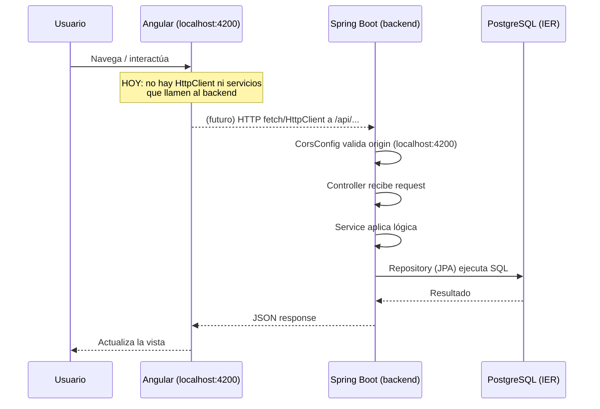
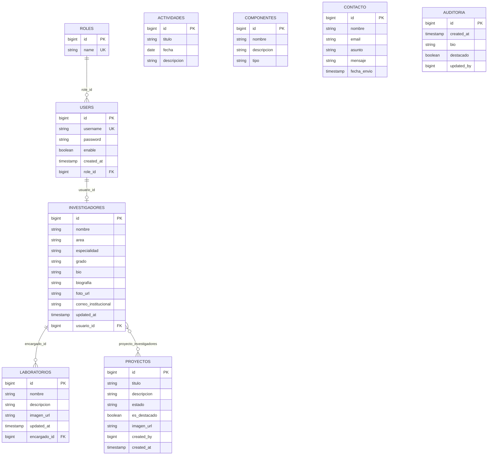

# PROJECT_CONTEXT.md — Instituto (IER)

Documentación técnica generada por análisis directo del código fuente. Todo lo aquí escrito corresponde a lo que existe hoy en el repositorio; donde algo no pudo determinarse, se indica explícitamente.

## Índice

0. [Limpieza y reorganización (2026-07-03)](#0-limpieza-y-reorganización-2026-07-03)
1. [Arquitectura general](#1-arquitectura-general)
2. [Backend](#2-backend)
3. [Frontend](#3-frontend)
4. [Comunicación Frontend ↔ Backend](#4-comunicación-frontend--backend)
5. [Base de datos](#5-base-de-datos)
6. [Flujo del sistema](#6-flujo-del-sistema)
7. [Dependencias](#7-dependencias)
8. [Variables de entorno / configuración](#8-variables-de-entorno--configuración)
9. [Seguridad](#9-seguridad)
10. [Problemas encontrados](#10-problemas-encontrados)
11. [Resumen para un nuevo desarrollador](#11-resumen-para-un-nuevo-desarrollador)
12. [Mapa completo del proyecto](#12-mapa-completo-del-proyecto)

---

## 0. Limpieza y reorganización (2026-07-03)

Se hizo una reestructuración del proyecto para eliminar desorden acumulado. Cambios aplicados:

| Antes | Después | Motivo |
|---|---|---|
| `api/api/` (doble anidación) | `backend/` | nombre plano y descriptivo, sin carpeta contenedora vacía |
| `frontend-instituto/` | `frontend/` | nombre corto y consistente con `backend/` |
| `api/.github/java-upgrade/`, `api/api/.github/java-upgrade/` | eliminados | logs de una herramienta automática de upgrade de Java, no era parte del proyecto |
| `backend/target/` | eliminado | artefacto de compilación Maven, se regenera con `mvn compile` |
| `frontend/.angular/cache/` | eliminado | caché de build de Angular, se regenera con `ng serve`/`ng build` |
| `TestController.java` (endpoint `/api/test/check-roles`) | eliminado | controlador de diagnóstico temporal, no era una funcionalidad real del sistema |
| `pom.xml`: `groupId` con espacio (`com.instituto `), `artifactId`/`name` = `api` | `groupId` limpio, `artifactId`/`name` = `backend` | typo corregido y nombre coherente con la carpeta |
| `app.config.ts` (copia duplicada de `app.ts`) | `app.config.ts` con el `ApplicationConfig` real (`provideRouter`) | es el patrón estándar de Angular; `main.ts` ahora importa `appConfig` en vez de tener los providers inline |
| `angular.json`, `package.json`, `package-lock.json`, `app.ts`, `app.spec.ts`: identificador `frontend-instituto` | `frontend` | coherencia con el nuevo nombre de carpeta |

**Verificado tras los cambios:** el backend compila (`./mvnw compile`) y el frontend tipa correctamente (`tsc --noEmit`) sin errores.

**No se tocó:**
- La lógica de negocio de los controllers/services (comentarios de parche, falta de capa Service en Actividad/Componente, manejo de excepciones) — es refactor de código, no limpieza de estructura; queda listado en [§10](#10-problemas-encontrados) para una siguiente pasada si se pide explícitamente.
- El `.git` interno de `frontend/` (Angular CLI lo crea automáticamente al hacer `ng new`) — la raíz del proyecto no es un repo git, así que no había nada que reconciliar; se dejó intacto para no perder su historial.
- `node_modules/` — no es basura de build gestionable por el proyecto, se reinstala con `npm install`, pero borrarlo no era necesario para la limpieza pedida.

---

## 1. Arquitectura general

- **Tipo de arquitectura:** dos proyectos independientes en el mismo repo (monorepo de facto, sin workspace ni script raíz que los una):
  - `backend` — backend REST en **Spring Boot** (arquitectura en capas: Controller → Service → Repository → Entity/JPA).
  - `frontend` — frontend en **Angular** (standalone components, sin NgModules).
- No hay `docker-compose.yml`, `Makefile` ni script en la raíz que levante ambos proyectos juntos. Se ejecutan por separado.
- **Backend:**
  - Java 17
  - Spring Boot **4.0.1** (`spring-boot-starter-parent`)
  - Maven (con wrapper `mvnw`)
  - PostgreSQL como base de datos
  - Lombok para reducir boilerplate (`@Data`)
- **Frontend:**
  - Angular **20.3.x** (standalone components, sin `NgModule`)
  - Bootstrap 5.3.8 + bootstrap-icons 1.13.1
  - RxJS 7.8, TypeScript 5.9.2
  - Karma/Jasmine para tests (solo specs por defecto, sin tests reales escritos)

---

## 2. Backend

### 2.1 Estructura de carpetas

```
backend/src/main/java/com/instituto/api/
├── ApiApplication.java        # punto de entrada
├── config/
│   └── CorsConfig.java
├── controller/                # capa REST (7 controllers)
├── entity/                    # entidades JPA (9 entidades)
├── repository/                # interfaces Spring Data JPA (9 repos)
└── service/                   # lógica de negocio (6 services)
```

### 2.2 Punto de entrada

`ApiApplication.java` — clase estándar `@SpringBootApplication` con `SpringApplication.run(...)`. Sin configuración adicional (sin `CommandLineRunner`, sin beans custom fuera de `CorsConfig`).

### 2.3 Configuración

- `application.properties`: conexión a PostgreSQL (`jdbc:postgresql://localhost:5432/IER`), usuario y **contraseña en texto plano** dentro del archivo versionable.
- `spring.jpa.hibernate.ddl-auto=none` — Hibernate **no** gestiona el esquema; las tablas se crean/mantienen manualmente en PostgreSQL (pgAdmin, según comentarios del código).
- `spring.jpa.show-sql=true` — logs de SQL activados (útil en dev, ruidoso/inseguro en prod).
- No existe `application-dev.properties` / `application-prod.properties` ni perfiles Spring (`spring.profiles.active`). Una sola configuración para todos los entornos.

### 2.4 Módulos y entidades

| Entidad | Tabla | Relaciones | Notas |
|---|---|---|---|
| `Usuario` | `users` | `@ManyToOne` → `Rol` | login: `username`, `password` (texto plano, sin hash — ver §9), `enable` |
| `Rol` | `roles` | — | columna `name` mapeada a campo `nombre` |
| `Investigador` | `investigadores` | `@OneToOne` → `Usuario` | perfil de investigador, se autogenera al registrar un `Usuario` con rol id `4` |
| `Laboratorio` | `laboratorios` | `@ManyToOne` → `Investigador` (encargado) | |
| `Proyecto` | `proyectos` | `@ManyToMany` → `Investigador` (tabla puente `proyecto_investigadores`) | campo `esDestacado` para destacar proyectos en home |
| `Actividad` | `actividades` | — | CRUD simple, sin service (el controller usa el repository directo) |
| `Componente` | `componentes` | — | CRUD simple, sin service |
| `Contacto` | `contacto` | — | formulario de contacto público, `fechaEnvio` autogenerado en `@PrePersist` |
| `Auditoria` | `auditoria` | — | registrado por `AuditoriaService`, pero **sin controller** que lo exponga (no alcanzable vía HTTP) |

### 2.5 Endpoints expuestos

| Recurso | Método | Ruta | Descripción |
|---|---|---|---|
| Actividades | GET/POST/PUT/DELETE | `/api/actividades`, `/{id}` | CRUD directo contra `ActividadRepository` (sin capa service) |
| Componentes | GET/POST/PUT/DELETE | `/api/componentes`, `/{id}` | CRUD directo contra `ComponenteRepository` (sin capa service) |
| Contacto | POST | `/api/contacto` | Guarda mensaje de contacto |
| Investigadores | GET/GET/POST/PUT/DELETE | `/api/investigadores`, `/{id}` | Vía `InvestigadorService` |
| Laboratorios | GET/GET/POST/PUT/DELETE | `/api/laboratorios`, `/{id}` | Vía `LaboratorioService`, resuelve `encargado` por id |
| Proyectos | GET/POST/PUT/DELETE | `/api/proyectos`, `/{id}` | Vía `ProyectoService`; tiene `@CrossOrigin("*")` propio además del CORS global |
| Usuarios | GET/GET/POST/DELETE | `/api/usuarios`, `/{username}` | Registro crea perfil de `Investigador` automáticamente si `rol.id == 4` |

No hay endpoint de **login** (`/login`, `/auth`, etc.) ni de recuperación de contraseña. No hay endpoint que exponga `Rol` ni `Auditoria` vía HTTP.

### 2.6 Seguridad, autenticación, JWT, CORS

- **No hay Spring Security en el classpath** (no está en `pom.xml`). No hay filtros de autenticación, no hay JWT, no hay sesiones, no hay roles aplicados a nivel de endpoint.
- Cualquier cliente puede llamar a cualquier endpoint sin autenticarse.
- **CORS:** configurado en `CorsConfig.java` (global, permite `http://localhost:4200`, métodos GET/POST/PUT/DELETE/OPTIONS, todos los headers) + un `@CrossOrigin("*")` adicional y redundante solo en `ProyectoController`.
- `UsuarioService.registrarUsuario` guarda la contraseña **tal cual llega en el body**, sin hashear (ver `Usuario.password`).

### 2.7 Flujo de una petición (ejemplo: crear un proyecto)

```
Cliente (Angular, futuro)
   │  POST /api/proyectos  { titulo, descripcion, ... }
   ▼
DispatcherServlet (Spring MVC)
   │  aplica CorsConfig (valida origin)
   ▼
ProyectoController.crear(@RequestBody Proyecto)
   │  deserializa JSON → entidad Proyecto (Jackson)
   ▼
ProyectoService.guardar(proyecto)
   ▼
ProyectoRepository.save(proyecto)   (Spring Data JPA)
   │  Hibernate ejecuta INSERT (ddl-auto=none, tabla ya existe)
   ▼
PostgreSQL (bd "IER")
   ▲  fila insertada, PK autogenerada (IDENTITY)
   │
ProyectoService retorna la entidad guardada
   │
ProyectoController envuelve en ResponseEntity con 201 CREATED
   ▼
Cliente recibe JSON de vuelta
```

Nota: no hay DTOs — las entidades JPA se serializan/deserializan directamente en los controllers (sin capa de mapeo, sin validación con `@Valid`/Bean Validation).

---

## 3. Frontend

### 3.1 Estado actual: **scaffold inicial**

El frontend está en una etapa muy temprana. Es esencialmente el resultado de `ng generate` sin lógica de negocio añadida:

- No existe **ningún servicio HTTP** (`HttpClient` no está provisto en `app.config.ts`, solo el router).
- No hay carpeta `services/`, `models/`, `guards/`, `interceptors/` ni `environments/`.
- No hay manejo de autenticación, tokens, `localStorage`/`sessionStorage`.
- No hay formularios (`ReactiveFormsModule`/`FormsModule` no importados en ningún componente).
- Los componentes de página (`home`, `quienes-somos`) solo contienen el HTML placeholder generado por Angular CLI (`<p>home works!</p>`).

### 3.2 Estructura

```
frontend/src/app/
├── app.ts / app.html / app.css   # componente raíz
├── app.config.ts                 # ApplicationConfig: providers (router)
├── app.routes.ts                 # rutas
├── components/
│   ├── navbar/   # navegación con RouterLink
│   └── footer/   # placeholder vacío
└── pages/
    ├── home/           # placeholder
    └── quienes-somos/  # placeholder
```

### 3.3 Rutas (`app.routes.ts`)

| Path | Componente |
|---|---|
| `/` | `HomeComponent` |
| `/quienes-somos` | `QuienesSomosComponent` |
| `**` | redirect a `/` |

### 3.4 Componentes

- `AppComponent` (raíz): monta `<app-navbar>`, `<router-outlet>`, `<app-footer>`.
- `NavbarComponent`: navegación Bootstrap con `routerLink`/`routerLinkActive` a Inicio y Quiénes Somos.
- `FooterComponent`, `HomeComponent`, `QuienesSomosComponent`: contenido placeholder sin lógica.

### 3.5 Librerías usadas

Bootstrap 5 + Bootstrap Icons para estilos (no se pudo confirmar si están importados en `angular.json`/`styles.css` — **no verificado en detalle**, requeriría revisar `angular.json` `styles` array).

---

## 4. Comunicación Frontend ↔ Backend

**Estado real: no implementada todavía.** El backend expone endpoints REST funcionales, pero el frontend no tiene ningún código que los consuma (sin `HttpClient`, sin servicios, sin fetch). El único vínculo hoy es la configuración de CORS en el backend, que anticipa que el frontend correrá en `http://localhost:4200`.

Diagrama de cómo **debería** fluir una vez se implemente el consumo (basado en los endpoints ya existentes):



No hay autenticación ni manejo de errores estandarizado en ningún lado del flujo (sin interceptor HTTP en Angular, sin `@ExceptionHandler`/`@ControllerAdvice` en Spring).

---

## 5. Base de datos

Motor: **PostgreSQL**, base de datos `IER`. El esquema no se gestiona desde el código (`ddl-auto=none`): las tablas existen ya en la base de datos y las entidades JPA están mapeadas para calzar con ellas. No se pudo inspeccionar el esquema real en PostgreSQL (no hay scripts `.sql` en el repo) — el diagrama de abajo se infiere únicamente de las anotaciones JPA en las entidades.



`ACTIVIDADES`, `COMPONENTES`, `CONTACTO` y `AUDITORIA` no tienen relaciones declaradas hacia otras entidades en el código Java (tablas independientes desde el punto de vista de JPA).

### CRUD por entidad

- **Actividad, Componente:** CRUD completo (GET/POST/PUT/DELETE), implementado directamente en el controller sin service intermedio.
- **Contacto:** solo POST (crear mensaje). No hay GET para listarlos ni panel de administración — **no verificado si existe en otro lugar**.
- **Investigador, Laboratorio, Proyecto, Usuario:** CRUD vía capa service.
- **Auditoria, Rol:** tienen service/repository pero **sin controller** — no accesibles vía HTTP hoy.

---

## 6. Flujo del sistema

Ejemplo — registro de un investigador (único flujo con lógica de negocio no trivial encontrado):

```
Cliente envía POST /api/usuarios con { username, password, rol: { id: 4 }, ... }
   ↓
UsuarioController.registrar()
   ↓
UsuarioService.registrarUsuario() [ @Transactional ]
   ↓
1. Guarda el Usuario en tabla users
   ↓
2. Si usuario.rol.id == 4 (INVESTIGADOR):
   crea un Investigador vacío, vinculado al usuario, con nombre = username
   ↓
3. Guarda el Investigador en tabla investigadores
   ↓
Retorna el Usuario creado (sin el investigador embebido en la respuesta)
```

El resto de los flujos (Actividad, Componente, Laboratorio, Proyecto, Contacto) son operaciones CRUD directas sin lógica adicional relevante.

**Flujo de login:** no existe. No hay controlador, servicio ni lógica de verificación de credenciales en ningún punto del backend. `UsuarioController.buscarPorUsername` devuelve el usuario completo (incluida la contraseña) dado un username, pero no valida ninguna contraseña.

---

## 7. Dependencias

### Backend (`pom.xml`)

| Dependencia | Uso |
|---|---|
| `spring-boot-starter-actuator` | endpoints de monitoreo/salud (`/actuator/*`) |
| `spring-boot-starter-data-jpa` | ORM (Hibernate) + Spring Data repositories |
| `spring-boot-starter-webmvc` | REST controllers, servlet container embebido |
| `postgresql` (runtime) | driver JDBC para PostgreSQL |
| `lombok` (optional) | genera getters/setters/equals/hashCode vía `@Data` |
| `spring-boot-starter-data-jpa-test`, `spring-boot-starter-webmvc-test` (test) | soporte de testing |

No hay Spring Security, no hay librería JWT (`jjwt`, `nimbus-jose-jwt`, etc.), no hay validación (`spring-boot-starter-validation`).

### Frontend (`package.json`)

| Dependencia | Uso |
|---|---|
| `@angular/core`, `common`, `compiler`, `platform-browser`, `router`, `forms` | framework Angular base |
| `bootstrap`, `bootstrap-icons` | estilos UI |
| `rxjs` | requerido por Angular (observables) |
| `zone.js` | detección de cambios de Angular |
| `tslib` | helpers de TypeScript compilado |

Sin `@angular/common/http` explícito en dependencias (viene incluido en `@angular/common`, pero no está provisto en `main.ts`).

---

## 8. Variables de entorno / configuración

No se usan variables de entorno (`System.getenv`, `${VAR}` en properties) — toda la configuración del backend está **hardcodeada** en `application.properties`:

| Clave | Para qué sirve | Dónde se usa |
|---|---|---|
| `spring.datasource.url` | conexión JDBC a PostgreSQL | autoconfiguración de Spring Data JPA |
| `spring.datasource.username` / `password` | credenciales de BD | ídem |
| `spring.datasource.driver-class-name` | driver JDBC | ídem |
| `spring.jpa.hibernate.ddl-auto` | controla si Hibernate modifica el esquema (`none` = no lo toca) | Hibernate |
| `spring.jpa.show-sql` / `format_sql` | logging de SQL en consola | Hibernate |

Frontend: no hay carpeta `environments/` ni variables de build-time detectadas.

---

## 9. Seguridad

### Estado actual
- **Sin autenticación:** todos los endpoints son públicos.
- **Sin autorización:** no hay roles aplicados a nivel de endpoint (aunque existe la entidad `Rol`, no se usa para restringir acceso).
- **Contraseñas en texto plano:** `Usuario.password` se guarda sin hash (ni BCrypt ni ningún otro).
- **Credenciales de BD versionadas en texto plano** en `application.properties`.
- **CORS abierto a un solo origin** en `CorsConfig`, pero además hay un `@CrossOrigin("*")` en `ProyectoController` que permite **cualquier origen** solo para ese recurso — inconsistente con el resto de la API.
- **Sin validación de entrada:** los controllers deserializan `@RequestBody` directo a entidades JPA sin `@Valid`/Bean Validation, por lo que se puede enviar cualquier payload (incluyendo relaciones anidadas) sin control.
- **Sin manejo global de excepciones:** errores de negocio (`RuntimeException` en `ProyectoService`, `LaboratorioService`) no están mapeados a códigos HTTP específicos — Spring devuelve 500 genérico.

### Recomendaciones (mínimas, priorizadas)
1. Agregar `spring-boot-starter-security` + hash de contraseñas (BCrypt) antes de exponer el registro de usuarios a producción.
2. Mover credenciales de BD a variables de entorno (`${DB_PASSWORD}`) y sacar `application.properties` con secretos del control de versiones.
3. Unificar la política de CORS (quitar el `@CrossOrigin("*")` suelto en `ProyectoController`).
4. Añadir `@Valid` + Bean Validation en los `@RequestBody` de los controllers.
5. Añadir un `@ControllerAdvice` para mapear excepciones a respuestas HTTP consistentes (404/400) en lugar de 500 genérico.

---

## 10. Problemas encontrados

Problemas ya corregidos en la limpieza del 2026-07-03 (ver [§0](#0-limpieza-y-reorganización-2026-07-03)) tachados; el resto sigue pendiente.

- ~~`app.config.ts` duplicado con `app.ts`~~ — **corregido**: ahora `app.config.ts` contiene el `ApplicationConfig` real.
- ~~`TestController` fuera de `controller/`, endpoint de diagnóstico suelto~~ — **corregido**: eliminado.
- ~~Carpetas `api/api` anidadas y nombres poco descriptivos~~ — **corregido**: renombradas a `backend`/`frontend`.
- ~~`target/`, `.angular/cache` y `.github/java-upgrade` (logs de una herramienta externa) presentes en el árbol~~ — **corregido**: eliminados.
- ~~`<groupId>com.instituto </groupId>` con espacio final en `pom.xml`~~ — **corregido**.
- **Falta de capa Service en `ActividadController` y `ComponenteController`:** acceden al repository directamente, inconsistente con el resto de controllers que sí pasan por un service. *(pendiente, requiere tocar lógica de negocio, fuera del alcance de una limpieza de estructura)*
- **`AuditoriaService` y `RolService` sin controller:** lógica implementada pero inalcanzable vía HTTP. *(pendiente)*
- **Manejo de errores con `RuntimeException` genérica** en `ProyectoService.actualizar` y `LaboratorioService.actualizar` en vez de excepciones específicas o `ResponseStatusException`. *(pendiente)*
- **Comentarios de depuración/parche dejados en el código** (p. ej. `// El import que faltaba`, `// Corregido: Asegúrate de que no tenga errores de dedo`, `// AJUSTE: He puesto el guion bajo final...`) — indican iteración manual rápida sin limpieza posterior. *(pendiente, no se tocó el código de negocio en esta pasada)*
- **Frontend sin ninguna integración real:** todas las páginas son placeholders (`<p>home works!</p>`), no hay consumo de la API — el "producto" visible hoy es solo el andamiaje de Angular CLI. *(pendiente, es una feature nueva, no una limpieza)*
- **`frontend/` tiene su propio repositorio git anidado** (un commit inicial de `ng new`), mientras que la raíz `proyecto_instituto/` no es un repo git. Si se quiere versionar todo el proyecto junto, hay que decidir si se conserva ese `.git` interno o se consolida en un único repo en la raíz — **no se tocó, es una decisión del usuario, no algo a limpiar unilateralmente**.

---

## 11. Resumen para un nuevo desarrollador

**¿Qué hace el proyecto?** Es el sitio/sistema de gestión de un instituto de investigación (IER): expone datos de investigadores, laboratorios, proyectos, actividades, componentes, y un formulario de contacto. Backend REST completo para estas entidades; frontend apenas iniciado (solo navegación y páginas vacías).

**¿Cómo está organizado?**
- `backend/` — backend Spring Boot. Todo el código Java vive bajo `src/main/java/com/instituto/api/`, separado en `controller/`, `service/`, `repository/`, `entity/`.
- `frontend/` — frontend Angular standalone, bajo `src/app/`, separado en `pages/` (rutas/vistas) y `components/` (reutilizables, navbar/footer).

**¿Dónde modificar funcionalidades existentes?**
- Reglas de negocio de una entidad → su clase en `service/`.
- Forma de la respuesta HTTP o rutas → su clase en `controller/`.
- Columnas/relaciones de BD → la entidad correspondiente en `entity/` (recordar que el esquema real vive en PostgreSQL, no lo genera Hibernate).

**¿Cómo agregar un endpoint nuevo?**
1. Si es una entidad nueva: crear `Entity` (`@Entity`, mapeo a tabla existente), `Repository` (`extends JpaRepository`), `Service` (lógica), `Controller` (`@RestController` + `@RequestMapping`).
2. Seguir el patrón ya usado por `InvestigadorController`/`InvestigadorService` como referencia (es el más completo).

**¿Cómo agregar una pantalla nueva en el frontend?**
1. `ng generate component pages/nombre-pantalla`.
2. Agregar la ruta en `src/app/app.routes.ts`.
3. Agregar el link en `navbar.html` si debe ser navegable.
4. (Pendiente en el proyecto) crear un servicio en `src/app/services/` que use `HttpClient` para consumir el backend — hoy no existe ningún ejemplo de esto en el repo, habría que introducirlo desde cero, incluyendo `provideHttpClient()` en `main.ts`.

**¿Cómo ejecutar el proyecto?**
- Backend: requiere PostgreSQL corriendo localmente con una base `IER` y las tablas ya creadas manualmente (el proyecto no trae migraciones ni scripts `.sql`). Luego, desde `backend/`: `./mvnw spring-boot:run` (puerto por defecto 8080, no sobreescrito en `application.properties`).
- Frontend: desde `frontend/`: `npm install` y luego `npm start` (`ng serve`, puerto 4200 por defecto, coincide con el CORS configurado en el backend).

---

## 12. Mapa completo del proyecto

```
proyecto_instituto/
├── PROJECT_CONTEXT.md                # este documento
│
├── backend/                          # backend Spring Boot
│   ├── pom.xml                       # dependencias y build Maven
│   ├── mvnw, mvnw.cmd                # wrapper de Maven
│   └── src/
│       ├── main/
│       │   ├── java/com/instituto/api/
│       │   │   ├── ApiApplication.java     # punto de entrada Spring Boot
│       │   │   ├── config/                  # configuración transversal (CORS)
│       │   │   ├── controller/               # capa REST (7 controllers)
│       │   │   ├── entity/                   # entidades JPA / modelo de datos (9)
│       │   │   ├── repository/                # interfaces Spring Data JPA (9)
│       │   │   └── service/                   # lógica de negocio (6 services)
│       │   └── resources/
│       │       └── application.properties    # config de BD y JPA
│       └── test/                              # tests (solo el generado por defecto)
│
└── frontend/                # frontend Angular (tiene su propio repo git interno, ver §0)
    ├── angular.json                   # config de build/serve de Angular CLI
    ├── package.json                   # dependencias npm
    ├── src/
    │   ├── main.ts                    # bootstrap de la app standalone
    │   ├── index.html
    │   └── app/
    │       ├── app.ts / app.html / app.css   # componente raíz (shell: navbar + router-outlet + footer)
    │       ├── app.config.ts          # ApplicationConfig: providers (router)
    │       ├── app.routes.ts          # definición de rutas
    │       ├── components/
    │       │   ├── navbar/            # barra de navegación superior
    │       │   └── footer/            # pie de página (placeholder)
    │       └── pages/
    │           ├── home/              # página de inicio (placeholder)
    │           └── quienes-somos/     # página institucional (placeholder)
    └── public/                        # assets estáticos (favicon)
```

---

*Documento generado a partir de una lectura completa del código fuente presente el 2026-07-03. No se ejecutó el proyecto ni se inspeccionó la base de datos real; las relaciones de BD se infirieron de las anotaciones JPA.*
